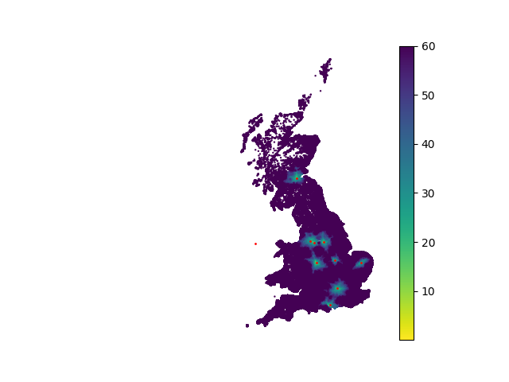

# UKRoutes

This project uses `cugraph`, a RAPIDS library, to estimate drive times from source nodes to destination nodes on the UK road network.

## Introduction

This project aims to provide an efficient way to estimate drive times across the UK road network. By leveraging the GPU-accelerated graph analytics capabilities of `cugraph`, we can handle large-scale graph data and perform drive time estimations quickly.

## Installation

### Requirements

This project requires a CUDA-enabled GPU, and Python >=3.10 and <=3.11.

You may install this project directly with pip (or similar) using:

```bash
pip install git+https://github.com/cjber/ukroutes
```

Alternatively you can install the project locally, using the following steps:

1. Clone the repository:
    ```bash
    git clone https://github.com/cjber/ukroutes.git
    cd ukroutes
    ```

2. Set up a Python virtual environment:
    ```bash
    python -m venv venv
    source venv/bin/activate  # On Windows, use `venv\Scripts\activate`
    ```

3. Install the required dependencies:
    ```bash
    pip install -r requirements.lock
    ```

## Usage

This project requires several data files that cannot be redistributed.

* OS Open Roads - [download](https://www.ordnancesurvey.co.uk/products/os-open-roads)
* ONS Postcodes - [download](https://geoportal.statistics.gov.uk/search?q=PRD_ONSPD&sort=Date%20Created%7Ccreated%7Cdesc) (Or similar target data)
* Ferry Routes - [download](http://overpass-turbo.eu/?q=LyoKVGhpcyBoYcSGYmVlbiBnxI1lcmF0ZWQgYnkgdGhlIG92xJJwxIlzLXR1cmJvIHdpemFyZC7EgsSdxJ9yaWdpbmFsIHNlxLBjaMSsxIk6CsOiwoDCnHJvdcSVPWbEknJ5xYjCnQoqLwpbxYx0Ompzb25dW3RpbWXFmzoyNV07Ci8vxI_ElMSdciByZXN1bHRzCigKICDFryBxdcSSxJrEo3J0IGZvcjogxYjFisWbZcWPxZHFk8KAxZXGgG5vZGVbIsWLxY1lIj0ixZByxZIiXSh7e2LEqnh9fSnFrcaAd2F5xp_GocSVxqTGpsaWxqrGrMauxrDGssa0xb_FtWVsxJRpxaDGusaTxr3Gp8apxqvGrcavb8axxrPFrceFxoJwxLduxorFtsW4xbrFvMWbxJjGnHnFrT7Frcejc2vHiMaDdDs&c=BH1aTWQmgG)

The following gives an example script that would be used to find the nearest 'health' assets to all Postcodes within the UK.

```python
import cudf
import geopandas as gpd
import pandas as pd

from ukroutes import Routing
from ukroutes.common.utils import Paths
from ukroutes.process_routing import add_to_graph, add_topk
from ukroutes.oproad.utils import process_oproad

# process oproad nodes and edges
nodes, edges = process_oproad(outdir=Paths.OS_GRAPH)  # or outdir=None

# read in health dataa and postcodes
health = (
    pd.read_parquet("./data/processed/health.parquet")
    .dropna()
    .sample(10)
    .reset_index(drop=True)
)
postcodes = pd.read_csv(
    "./data/raw/onspd/ONSPD_FEB_2024.csv",
    usecols=["PCD", "OSEAST1M", "OSNRTH1M", "DOTERM", "CTRY"],
)
postcodes = (
    postcodes[
        (postcodes["DOTERM"].isnull())
        & (~postcodes["CTRY"].isin(["N92000002", "L93000001", "M83000003"]))
    ]
    .drop(columns=["DOTERM", "CTRY"])
    .rename({"PCD": "postcode", "OSEAST1M": "easting", "OSNRTH1M": "northing"}, axis=1)
    .dropna()
    .reset_index(drop=True)
)

# add health and postcodes to road network
health, nodes, edges = add_to_graph(health, nodes, edges, 1)
postcodes, nodes, edges = add_to_graph(postcodes, nodes, edges, 1)

# find the top 10 closest health facilities to each postcode
health = add_topk(health, postcodes, 10)

# run the routing class
routing = Routing(
    edges=edges,
    nodes=nodes,
    outputs=postcodes,
    inputs=health,
    weights="time_weighted",
    min_buffer=5000,
    max_buffer=500_000,
    cutoff=300,
)
routing.fit()

# join distances to postcodes
distances = gpd.GeoDataFrame(
    distances, geometry=gpd.points_from_xy(distances.easting, distances.northing)
)
distances.loc[distances["distance"] > 60, "distance"] = 60

```

This example code produces the following result:

```python
import matplotlib.pyplot as plt

fig, ax = plt.subplots()
distances.reset_index().sort_values("distance").plot(
    column="distance", cmap="viridis_r", legend=True, markersize=0.5, ax=ax
)
health.plot(x="easting", y="northing", color="red", ax=ax, kind="scatter", s=1)
ax.set_axis_off()

plt.show()
```



# Routing Methodology

The primary goal of this project is to determine the distance of points of interest to each postcode within Great Britain. Given there are over 1.7 million postcodes, instead of routing from each postcode to each point of interest, the processing is inverted, routing from points of interest to postcodes within a buffer. The following gives an overview of the sequential processing involved to achieve this.

1. **Process the OS Open Road Network**

Ordnance Survey publish road speed estimates alongside their road network documentation. These estimates are used to provide average speed estimates and subsequent drive-time estimates using the length of `linestring` geometries. For example the road speed estimate for all motorways is 67mph, while for single carriageway A and B roads the estimate is 25mph. These speeds are converted to drive-time in minutes using the road length.

OS Open Roads does not include ferry routes. These were therefore taken from OpenStreetMap (OSM), using the Overpass API (http://overpass-turbo.eu) with the query found [here](http://overpass-turbo.eu/?q=LyoKVGhpcyBoYcSGYmVlbiBnxI1lcmF0ZWQgYnkgdGhlIG92xJJwxIlzLXR1cmJvIHdpemFyZC7EgsSdxJ9yaWdpbmFsIHNlxLBjaMSsxIk6CsOiwoDCnHJvdcSVPWbEknJ5xYjCnQoqLwpbxYx0Ompzb25dW3RpbWXFmzoyNV07Ci8vxI_ElMSdciByZXN1bHRzCigKICDFryBxdcSSxJrEo3J0IGZvcjogxYjFisWbZcWPxZHFk8KAxZXGgG5vZGVbIsWLxY1lIj0ixZByxZIiXSh7e2LEqnh9fSnFrcaAd2F5xp_GocSVxqTGpsaWxqrGrMauxrDGssa0xb_FtWVsxJRpxaDGusaTxr3Gp8apxqvGrcavb8axxrPFrceFxoJwxLduxorFtsW4xbrFvMWbxJjGnHnFrT7Frcejc2vHiMaDdDs&c=BH1aTWQmgG). `KDTree` from `scipy.spatial` was then used to determine the nearest road node point to the start and end location of these routes, allowing for them to be added directly to the road network. The speed estimate for these routes is 25mph, around the speed of an average ferry.

Despite the addition of ferry routes connecting isolated road networks on islands to the mainland, there were still road nodes that did not connect directly to the road network. These did not appear to follow any pattern; distributed evenly across GB. These were therefore removed using the `cugraph.connected_components()` function.

2. **Add Postcodes and POIs to the road network**

The `add_to_graph` function creates new nodes at the location of a collection of easting and northing coordinates. These nodes are then added to the road network by generating a new edge between this point and the nearest `k` road nodes using a `KDTree`, with a speed estimate of 25mph.

3. **Determine the top `k` POIs to each postcode**

The function `add_topk` determines the top `k` POI nodes to each postcode node. This function then determines which POI are associated with each postcode and saves them as a list, then assigns a buffer to each POI, indicating the Euclidean distance to the furthest postcode. This information is then used for the routing.

4. **Routing from POIs to postcodes**

While the interest is in determining the distance from postcodes to POIs, the previous processing allows for a large speed-up by considering the reverse of this task. The `Routing` class in `routing.py` primarily routes using the Single Source Shortest Path `cugraph.sssp` algorithm, which allows for weighted routing from a single source to all other nodes in a graph. The graph itself is therefore filtered for each POI using the buffer determined in the `add_topk` function, and increased (if required) until all important postcodes relating to a POI are found within this subgraph. This approach means that for each postcode, the minimum returned distance indicates the nearest POI by drive-time.
